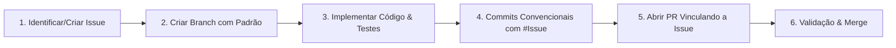

# 🤖 Diretrizes para Agentes de IA & Modelos de Linguagem (AGENTS.md)

Este documento define as **regras obrigatórias e inegociáveis** que qualquer Agente de IA (qualquer modelo: Gemini, Claude, GPT, DeepSeek, etc.) ou desenvolvedor automatizado deve seguir estritamente ao propor código, melhorias, correções ou refatorações neste repositório.

---

## 🛑 Regra de Ouro da Governança

> **NUNCA crie um Pull Request (PR) ou submeta alterações de código sem antes associá-lo a uma GitHub Issue aberta correspondente.**
> **A descrição do Pull Request DEVE OBRIGATORIAMENTE conter a menção explícita à Issue (`Closes #X`, `Fixes #X` ou `Relates to #X`).**

---

## 🔄 Fluxo de Trabalho Obrigatório do Agente

### Passo 1: Vínculo com a Issue
Antes de gerar ou modificar arquivos:
1. Verifique se já existe uma issue aberta para o problema ou funcionalidade no catálogo [`.github/ISSUES_CATALOG.md`](.github/ISSUES_CATALOG.md).
2. Se não existir, defina a issue no formato adequado (**SEMPRE com título e descrição em Português**):
   - **Nova Funcionalidade**: `[Funcionalidade] Nome da nova funcionalidade (#X)`
   - **Correção de Bug**: `[Correção] Descrição do problema corrigido (#X)`
   - **Resiliência & Políticas**: `[Resiliência] Descrição da política ou ajuste (#X)`
   - **Documentação**: `[Documentação] Atualização de documentação (#X)`

### Passo 2: Nomenclatura da Branch
Toda branch deve ser nomeada seguindo o padrão com o ID da issue:
- **Nova funcionalidade**: `feat/issue-<numero>-<slug-da-feature>`
- **Correção de bug**: `fix/issue-<numero>-<slug-do-bug>`
- **Resiliência/Refatoração**: `refactor/issue-<numero>-<slug>`
- **Documentação**: `docs/issue-<numero>-<slug>`

### Passo 3: Padrão de Commits (Conventional Commits)
Inclua a referência à issue no commit:
- `feat(#01): implementa motor de resiliencia com timeout e fallback`
- `fix(#03): corrige retorno de problema no formato RFC 7807`

---

## 🛡️ Diretrizes de Arquitetura do BuscaCep
- Respeitar a separação modular de responsabilidades (`js/validator.js`, `js/cacheManager.js`, `js/resilienceEngine.js`, `js/addressService.js`).
- Manter o timeout padrão de 2.000 ms nas chamadas HTTP para o ViaCEP.
- Respeitar o TTL de 24 horas para o armazenamento em cache.
- Não introduzir dependências de compilação no frontend principal; manter compatível com execução nativa em navegador.
