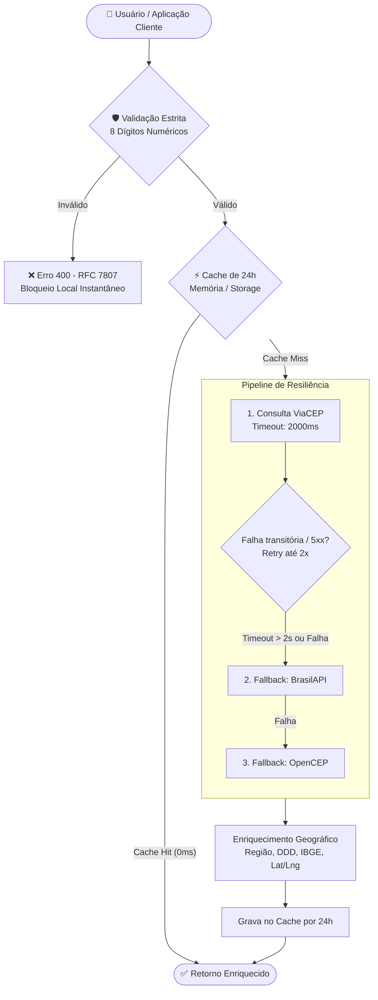

# 🏆 BuscaCep • Microsserviço de Busca & Validação de Endereços

Um microsserviço completo, resiliente, de altíssimo desempenho e moderno para **busca, validação e enriquecimento de CEPs e endereços brasileiros**, integrando de forma transparente **ViaCEP** e **BrasilAPI** com motor de resiliência inspirado no padrão **Polly** (Timeout estrito de 2 segundos, Retry de 2x com backoff, Fallbacks em cascata e Circuit Breaker), sistema de **Caching de 24 horas** (0ms de resposta), validação estrita **RFC 7807** e governança total via GitHub Issues.

---

## 🚀 Destaques & Diferenciais do Projeto

- 🛡️ **Motor de Resiliência no Padrão Polly**:
  - **Timeout Estrito (2s)**: Se o ViaCEP demorar mais de 2.000 ms, a chamada é abortada imediatamente.
  - **Retry com Backoff Exponencial & Jitter**: Tenta novamente até 2 vezes com intervalo curto em caso de falha transitória (erros $5xx$ ou timeout de rede).
  - **Fallback Automático (BrasilAPI & OpenCEP)**: Caso o ViaCEP falhe ou expire o tempo, a requisição é redirecionada de forma transparente para a BrasilAPI.
  - **Circuit Breaker**: Protege o sistema contra tempestades de requisições a serviços instáveis.
- ⚡ **Caching Multi-Camada de 24 Horas**:
  - Endereço é um dado fixo: a primeira consulta grava os dados enriquecidos por 24 horas.
  - As consultas seguintes respondem em **0ms (Cache Hit)**, economizando requisições externas e garantindo máxima velocidade.
  - Painel de métricas em tempo real (Taxa de Acertos %, tempo de rede economizado e expurgo seletivo).
- 🔒 **Validação Estrita & RFC 7807 (Problem Details)**:
  - Sanitização automática e validação de 8 dígitos numéricos antes de disparar qualquer tráfego de rede.
  - Rejeição imediata de sequências conhecidas (`00000000`, `11111111`, etc.).
  - Respostas de erro padronizadas mundialmente com `type`, `title`, `status`, `detail`, `instance` e `traceId`.
- 🗺️ **Visualização Interativa de Mapas (OpenStreetMap / Leaflet)**:
  - Localização pontual do endereço no mapa interativo com links diretos para Google Maps e Waze.
- 📦 **Busca de CEPs em Lote (Batch Search)**:
  - Processamento de listas e planilhas com controle de vazão (throttling), barra de progresso visual e exportação com 1 clique para **CSV (Excel UTF-8)** e **JSON**.
- 🧪 **Simulador de Resiliência & Caos (Live Playground)**:
  - Permite ao desenvolvedor injetar artificialmente Timeout (> 2s), Erro 500 no ViaCEP ou Rede Lenta para assistir ao vivo à ativação do Fallback no console de logs em tempo real.
- 💻 **API Explorer & Gerador de Código em 5 Linguagens**:
  - Snippets prontos para cópia em **cURL**, **C# .NET 8 (Polly v8)**, **JavaScript (Fetch)**, **Python (requests)** e **PHP 8**.
- 💼 **Arquitetura de Referência .NET 8 / C#**:
  - Projeto Minimal API em C# com `Microsoft.Extensions.Http.Resilience` e `IMemoryCache` localizado na pasta `src-dotnet-reference/`.

---

## 📐 Arquitetura do Fluxo de Execução



---

## 🖥️ Como Executar o Projeto

Como o BuscaCep foi desenvolvido com tecnologias web nativas e modulares (HTML5 semântico, CSS3 Moderno com Design System e Vanilla JavaScript ES Modules), **nenhuma instalação pesada ou runtime de build é obrigatória**:

### Opção 1: Execução Direta no Navegador
Basta dar um duplo clique no arquivo [`index.html`](./index.html) para abri-lo em qualquer navegador moderno (Chrome, Edge, Firefox, Safari, Brave).

### Opção 2: Com Servidor Local
Se desejar executar com um servidor local:
```powershell
# Com Python 3
python -m http.server 8080

# Ou abrindo diretamente
Start-Process "index.html"
```

---

## 💻 Exemplo de Uso da API em C# (.NET 8 com Polly v8)

```csharp
using System.Net.Http.Json;
using Microsoft.Extensions.Caching.Memory;
using Polly;

var builder = WebApplication.CreateBuilder(args);
builder.Services.AddMemoryCache();

// Configura HttpClient do ViaCEP com Polly Resilience Handler
builder.Services.AddHttpClient("ViaCep", client => {
    client.BaseAddress = new Uri("https://viacep.com.br/");
    client.Timeout = TimeSpan.FromSeconds(2); // Timeout estrito de 2s
}).AddStandardResilienceHandler(options => {
    options.AttemptTimeout.Timeout = TimeSpan.FromSeconds(2);
    options.Retry.MaxRetryAttempts = 2; // Até 2 tentativas
});

// Configura HttpClient do BrasilAPI (Fallback)
builder.Services.AddHttpClient("BrasilApi", client => {
    client.BaseAddress = new Uri("https://brasilapi.com.br/");
});
```

---

## 🏛️ Governança do Projeto & Padrões GitHub

Este repositório adota um padrão estrito de governança para manter rastreabilidade total de todas as alterações feitas por desenvolvedores ou **Agentes de IA**:

### 📜 Regras Obrigatórias:
1. **Toda alteração deve ser iniciada a partir de uma GitHub Issue.**
2. **Todo Pull Request (PR) deve conter o vínculo explícito à sua Issue:**
   - `Closes #X` (Para Novas Funções ou Tarefas)
   - `Fixes #X` (Para Correções de Bugs)
   - `Relates to #X` (Para PRs correlatos ou parciais)
3. **Padrão de Branches:** `feat/issue-X-...`, `fix/issue-X-...`, `refactor/issue-X-...`, `docs/issue-X-...`
4. **Padrão de Commits:** Conventional Commits (`feat(#X): ...`, `fix(#X): ...`, `refactor(#X): ...`).

> 📖 **Catálogo de Issues:** Consulte [`.github/ISSUES_CATALOG.md`](.github/ISSUES_CATALOG.md) para ver todas as especificações das issues.  
> 🤖 **Atenção Agentes de IA:** É obrigatório ler e seguir o arquivo [`AGENTS.md`](./AGENTS.md).  
> 👥 **Contribuidores Humanos:** Consultem o guia [`CONTRIBUTING.md`](./CONTRIBUTING.md).

---

## 🚀 Publicação Automática no GitHub com 1 Clique

Para enviar este projeto diretamente para o seu GitHub e criar todas as issues catalogadas:

```powershell
powershell -ExecutionPolicy Bypass -File .github/publicar_projeto.ps1
```

---

## 📄 Licença
Distribuído sob a licença **MIT**. Veja o arquivo [`LICENSE`](LICENSE) para mais detalhes.
